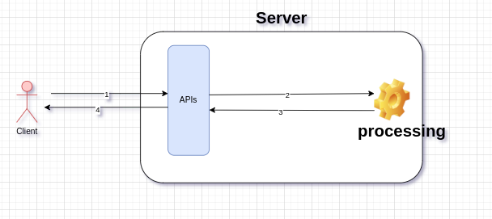
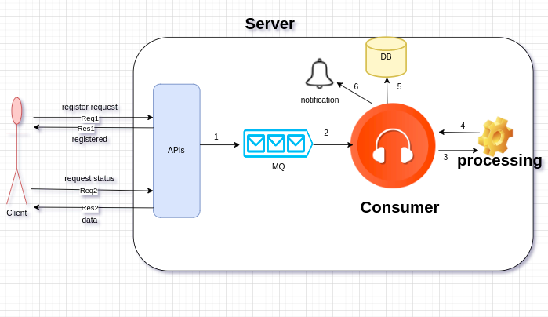

## Welcome To Alraedah application

# NodJs - Express - MQ - MONGODB- Unit Test - Swagger - OpenAPI  


## Packages Installed
- Nodejs  14.17.6
- npm 7.21.1
- nodemon 2.0.16


## Usage Server

- Clone/Download a repo 
- Run `cd server`
- Run `cp .env.Example .env` and update MONGO DB && MQ credentials 
- Run `npm i`
- Run `npm start` 


## Docs

Run `/api-docs` end point to get the full api documentation


## Execute Directly




```
http://localhost:3000/api/v1/requests/execute

```

## Execute By Queue



# Client Requests:
1- register the request
```
http://localhost:3000/api/v1/requests/register

```
2- reply to client that your request is registered without wating the process.
3- fetch request status and data.

```
http://localhost:3000/api/v1/requests/:requestId
requestId    : Request Id

```


# Background  Process:
1- Register the request in DB with uniqe number and push to MQ.
2- Consumer will  recive the message.
3- Handling the request.
4- Fetching the output.
5- Update the request status and store the output.
6- Notify Client.

